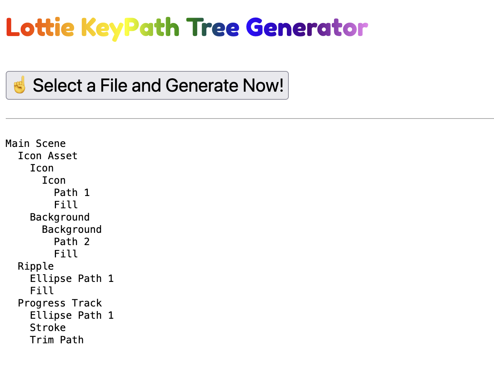
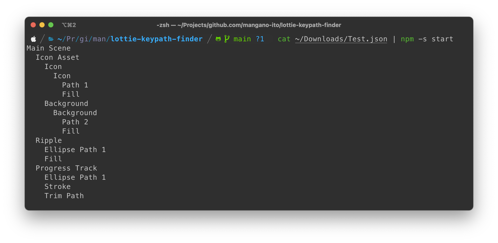

# lottie-keypath-finder

A tool to dump KeyPath tree from Lottie JSON.

## Live Demo

https://mangano-ito.github.io/lottie-keypath-finder/

Upload your Lottie JSON and you'll see the KeyPath Tree!



## Usage in CLI

Clone the repo, install and run:

```sh
npm install
cat (your Lottie JSON file) | npm -s run start:cli
```

then, you'll get the tree:


